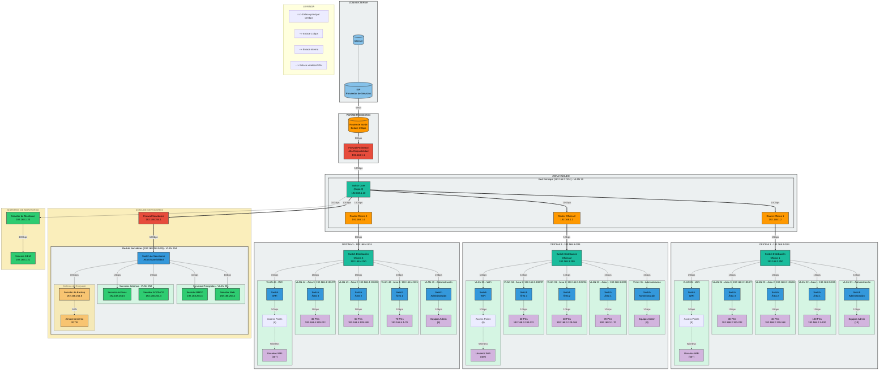

# Diagrama de Red Empresarial

```mermaid
flowchart TD
    %% Definición de estilos
    classDef router fill:#ff9900,stroke:#333,stroke-width:2px,color:black;
    classDef coreSwitch fill:#1abc9c,stroke:#333,stroke-width:2px,color:black;
    classDef accessSwitch fill:#3498db,stroke:#333,stroke-width:2px,color:black;
    classDef firewall fill:#e74c3c,stroke:#333,stroke-width:2px,color:black;
    classDef server fill:#2ecc71,stroke:#333,stroke-width:2px,color:black;
    classDef client fill:#d2b4de,stroke:#333,stroke-width:1px,color:black;
    classDef network fill:#ecf0f1,stroke:#333,stroke-width:2px,color:black;
    classDef subnet fill:#f5f5f5,stroke:#95a5a6,stroke-width:1px,color:black;
    classDef zone fill:#f9e79f,stroke:#333,stroke-width:1px,color:black,opacity:0.7;
    classDef internet fill:#85c1e9,stroke:#333,stroke-width:2px,color:black;
    classDef backup fill:#f8c471,stroke:#333,stroke-width:2px,color:black;
    classDef vlan fill:#d5f5e3,stroke:#333,stroke-width:1px,color:black;
    classDef linkPrimary stroke:#e74c3c,stroke-width:3px;
    classDef linkSecondary stroke:#3498db,stroke-width:2px;
    classDef linkInternal stroke:#2ecc71,stroke-width:2px;
    
    %% INTERNET Y CONEXIÓN PRINCIPAL
    subgraph EXTERNAL["ZONA EXTERNA"]
        INTERNET[("Internet")]
        ISP[("ISP<br>Proveedor de Servicios")]
        INTERNET --- ISP
    end
    
    %% PERIMETRO DE RED
    subgraph PERIMETER["PERÍMETRO DE RED"]
        RTR_BORDE[("Router de Borde<br>Enlace 1Gbps")]
        FW_EXT["Firewall Perimetral<br>Alta Disponibilidad<br>192.168.1.1"]
    end
    ISP ===|"WAN"| RTR_BORDE
    RTR_BORDE ==>|"1Gbps"| FW_EXT
    
    %% RED PRINCIPAL - ZONA SEGURA
    subgraph CORE["ZONA NÚCLEO"]
        subgraph RED_PRINCIPAL["Red Principal (192.168.1.0/24) - VLAN 10"]
            SW_CORE["Switch Core<br>(Capa 3)<br>192.168.1.10"]
            
            %% Routers
            R1["Router Oficina 1<br>192.168.1.2"]
            R2["Router Oficina 2<br>192.168.1.3"]
            R3["Router Oficina 3<br>192.168.1.4"]
            
            %% Links redundantes
            SW_CORE ==>|"10Gbps"| R1
            SW_CORE ==>|"10Gbps"| R2
            SW_CORE ==>|"10Gbps"| R3
        end
    end
    FW_EXT ==>|"10Gbps"| SW_CORE
    
    %% RED DE SERVIDORES
    subgraph SRV_ZONE["ZONA DE SERVIDORES"]
        FW_SRV["Firewall Servidores<br>192.168.254.1"]
        
        subgraph SERVIDORES["Red de Servidores (192.168.254.0/29) - VLAN 254"]
            SW_SRV["Switch de Servidores<br>Alta Disponibilidad"]
            
            subgraph SERV_VLAN1["Servicios Principales - VLAN 251"]
                SRV1["Servidor Web<br>192.168.254.2"]
                SRV2["Servidor BBDD<br>192.168.254.3"]
            end
            
            subgraph SERV_VLAN2["Servicios Internos - VLAN 252"]
                SRV3["Servidor AD/DHCP<br>192.168.254.4"]
                SRV4["Servidor Archivos<br>192.168.254.5"]
            end
            
            subgraph BACKUP["Sistema de Respaldo"]
                SRV_BKP["Servidor de Backup<br>192.168.254.6"]
                STORAGE["Almacenamiento<br>20 TB"]
                SRV_BKP -.->|"SAN"| STORAGE
            end
            
            SW_SRV -->|"1Gbps"| SRV1
            SW_SRV -->|"1Gbps"| SRV2
            SW_SRV -->|"1Gbps"| SRV3
            SW_SRV -->|"1Gbps"| SRV4
            SW_SRV -->|"10Gbps"| SRV_BKP
        end 
    end
    
    SW_CORE ==>|"10Gbps"| FW_SRV
    FW_SRV ==>|"10Gbps"| SW_SRV
    
    %% OFICINA 1
    subgraph OF1["OFICINA 1 - 192.168.2.0/24"]
        direction TB
        SW_DIST1["Switch Distribución<br>Oficina 1<br>192.168.2.250"]
        
        subgraph VLAN_OF1_ADM["VLAN 21 - Administración"]
            SW_OF1_ADM["Switch<br>Administración"]
            PC_OF1_ADM["Equipos Admin<br>(10)"]
            SW_OF1_ADM -->|"1Gbps"| PC_OF1_ADM
        end
        
        subgraph VLAN_OF1_1["VLAN 22 - Área 1: 192.168.2.0/25"]
            SW_OF1_1["Switch<br>Área 1"]
            PC_OF1_1["100 PCs<br>192.168.2.1-100"]
            SW_OF1_1 -->|"1Gbps"| PC_OF1_1
        end
        
        subgraph VLAN_OF1_2["VLAN 23 - Área 2: 192.168.2.128/26"]
            SW_OF1_2["Switch<br>Área 2"]
            PC_OF1_2["40 PCs<br>192.168.2.129-168"]
            SW_OF1_2 -->|"1Gbps"| PC_OF1_2
        end
        
        subgraph VLAN_OF1_3["VLAN 24 - Área 3: 192.168.2.192/27"]
            SW_OF1_3["Switch<br>Área 3"]
            PC_OF1_3["30 PCs<br>192.168.2.193-222"]
            SW_OF1_3 -->|"1Gbps"| PC_OF1_3
        end
        
        subgraph VLAN_OF1_WIFI["VLAN 25 - WiFi"]
            SW_OF1_WIFI["Switch<br>WiFi"]
            AP_OF1["Access Points<br>(8)"]
            WIFI_USERS["Usuarios WiFi<br>(50+)"]
            SW_OF1_WIFI -->|"1Gbps"| AP_OF1 -.->|"Wireless"| WIFI_USERS
        end
        
        SW_DIST1 -->|"1Gbps"| SW_OF1_ADM
        SW_DIST1 -->|"1Gbps"| SW_OF1_1
        SW_DIST1 -->|"1Gbps"| SW_OF1_2
        SW_DIST1 -->|"1Gbps"| SW_OF1_3
        SW_DIST1 -->|"1Gbps"| SW_OF1_WIFI
    end
    
    %% OFICINA 2
    subgraph OF2["OFICINA 2 - 192.168.3.0/24"]
        direction TB
        SW_DIST2["Switch Distribución<br>Oficina 2<br>192.168.3.250"]
        
        subgraph VLAN_OF2_ADM["VLAN 31 - Administración"]
            SW_OF2_ADM["Switch<br>Administración"]
            PC_OF2_ADM["Equipos Admin<br>(8)"]
            SW_OF2_ADM -->|"1Gbps"| PC_OF2_ADM
        end
        
        subgraph VLAN_OF2_1["VLAN 32 - Área 1: 192.168.3.0/25"]
            SW_OF2_1["Switch<br>Área 1"]
            PC_OF2_1["70 PCs<br>192.168.3.1-70"]
            SW_OF2_1 -->|"1Gbps"| PC_OF2_1
        end
        
        subgraph VLAN_OF2_2["VLAN 33 - Área 2: 192.168.3.128/26"]
            SW_OF2_2["Switch<br>Área 2"]
            PC_OF2_2["40 PCs<br>192.168.3.129-168"]
            SW_OF2_2 -->|"1Gbps"| PC_OF2_2
        end
        
        subgraph VLAN_OF2_3["VLAN 34 - Área 3: 192.168.3.192/27"]
            SW_OF2_3["Switch<br>Área 3"]
            PC_OF2_3["30 PCs<br>192.168.3.193-222"]
            SW_OF2_3 -->|"1Gbps"| PC_OF2_3
        end
        
        subgraph VLAN_OF2_WIFI["VLAN 35 - WiFi"]
            SW_OF2_WIFI["Switch<br>WiFi"]
            AP_OF2["Access Points<br>(6)"]
            WIFI_USERS2["Usuarios WiFi<br>(40+)"]
            SW_OF2_WIFI -->|"1Gbps"| AP_OF2 -.->|"Wireless"| WIFI_USERS2
        end
        
        SW_DIST2 -->|"1Gbps"| SW_OF2_ADM
        SW_DIST2 -->|"1Gbps"| SW_OF2_1
        SW_DIST2 -->|"1Gbps"| SW_OF2_2
        SW_DIST2 -->|"1Gbps"| SW_OF2_3
        SW_DIST2 -->|"1Gbps"| SW_OF2_WIFI
    end
    
    %% OFICINA 3
    subgraph OF3["OFICINA 3 - 192.168.4.0/24"]
        direction TB
        SW_DIST3["Switch Distribución<br>Oficina 3<br>192.168.4.250"]
        
        subgraph VLAN_OF3_ADM["VLAN 41 - Administración"]
            SW_OF3_ADM["Switch<br>Administración"]
            PC_OF3_ADM["Equipos Admin<br>(8)"]
            SW_OF3_ADM -->|"1Gbps"| PC_OF3_ADM
        end
        
        subgraph VLAN_OF3_1["VLAN 42 - Área 1: 192.168.4.0/25"]
            SW_OF3_1["Switch<br>Área 1"]
            PC_OF3_1["70 PCs<br>192.168.4.1-70"]
            SW_OF3_1 -->|"1Gbps"| PC_OF3_1
        end
        
        subgraph VLAN_OF3_2["VLAN 43 - Área 2: 192.168.4.128/26"]
            SW_OF3_2["Switch<br>Área 2"]
            PC_OF3_2["60 PCs<br>192.168.4.129-188"]
            SW_OF3_2 -->|"1Gbps"| PC_OF3_2
        end
        
        subgraph VLAN_OF3_3["VLAN 44 - Área 3: 192.168.4.192/27"]
            SW_OF3_3["Switch<br>Área 3"]
            PC_OF3_3["30 PCs<br>192.168.4.193-222"]
            SW_OF3_3 -->|"1Gbps"| PC_OF3_3
        end
        
        subgraph VLAN_OF3_WIFI["VLAN 45 - WiFi"]
            SW_OF3_WIFI["Switch<br>WiFi"]
            AP_OF3["Access Points<br>(6)"]
            WIFI_USERS3["Usuarios WiFi<br>(40+)"]
            SW_OF3_WIFI -->|"1Gbps"| AP_OF3 -.->|"Wireless"| WIFI_USERS3
        end
        
        SW_DIST3 -->|"1Gbps"| SW_OF3_ADM
        SW_DIST3 -->|"1Gbps"| SW_OF3_1
        SW_DIST3 -->|"1Gbps"| SW_OF3_2
        SW_DIST3 -->|"1Gbps"| SW_OF3_3
        SW_DIST3 -->|"1Gbps"| SW_OF3_WIFI
    end
    
    %% SISTEMAS DE MONITOREO
    subgraph MONITORING["SISTEMAS DE MONITOREO"]
        MON_SRV["Servidor de Monitoreo<br>192.168.1.20"]
        SIEM["Sistema SIEM<br>192.168.1.21"]
        MON_SRV -->|"10Gbps"| SIEM
    end
    
    %% CONEXIONES FINALES
    R1 ==>|"1Gbps"| SW_DIST1
    R2 ==>|"1Gbps"| SW_DIST2
    R3 ==>|"1Gbps"| SW_DIST3
    SW_CORE -->|"10Gbps"| MON_SRV
    
    %% LEYENDA DE CONEXIONES
    subgraph LEYENDA["LEYENDA"]
        direction LR
        L1["==> Enlace principal 10Gbps"] 
        L2["--> Enlace 1Gbps"]
        L3["--> Enlace interno"] 
        L4["-.-> Enlace wireless/SAN"]
    end
    
    %% Aplicar estilos
    class RTR_BORDE,R1,R2,R3 router;
    class SW_CORE,SW_DIST1,SW_DIST2,SW_DIST3 coreSwitch;
    class SW_OF1_1,SW_OF1_2,SW_OF1_3,SW_OF1_ADM,SW_OF1_WIFI,SW_OF2_1,SW_OF2_2,SW_OF2_3,SW_OF2_ADM,SW_OF2_WIFI,SW_OF3_1,SW_OF3_2,SW_OF3_3,SW_OF3_ADM,SW_OF3_WIFI,SW_SRV accessSwitch;
    class FW_EXT,FW_SRV firewall;
    class SRV1,SRV2,SRV3,SRV4,MON_SRV,SIEM server;
    class PC_OF1_1,PC_OF1_2,PC_OF1_3,PC_OF1_ADM,WIFI_USERS,PC_OF2_1,PC_OF2_2,PC_OF2_3,PC_OF2_ADM,WIFI_USERS2,PC_OF3_1,PC_OF3_2,PC_OF3_3,PC_OF3_ADM,WIFI_USERS3 client;
    class SRV_BKP,STORAGE backup;
    class INTERNET,ISP internet;
    class OF1,OF2,OF3,RED_PRINCIPAL,SERVIDORES,CORE,PERIMETER,EXTERNAL network;
    class VLAN_OF1_1,VLAN_OF1_2,VLAN_OF1_3,VLAN_OF1_ADM,VLAN_OF1_WIFI,VLAN_OF2_1,VLAN_OF2_2,VLAN_OF2_3,VLAN_OF2_ADM,VLAN_OF2_WIFI,VLAN_OF3_1,VLAN_OF3_2,VLAN_OF3_3,VLAN_OF3_ADM,VLAN_OF3_WIFI,SERV_VLAN1,SERV_VLAN2 vlan;
    class MONITORING,BACKUP,SRV_ZONE zone;
```
